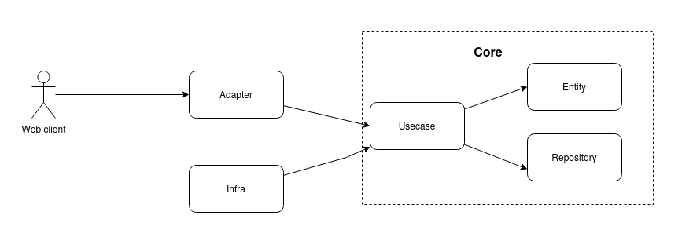

<div align="center"><h2>Desafio Eulabs Backend</h2></div>


## Criar uma API

### Requisitos
A API a ser desenvolvida deve conter rotas
C.R.U.D. de produtos, seguindo um bom design
de API.

Requisitos:
- Rota para criação de produtos.
- Rota para consulta de produtos.
- Rota para atualização de produtos.
- Rota para exclusão de produtos.

### Design da api

Essa api segue o design do `clean architecture` dividida nas camadas conforme abaixo:


<br />

 - Adapter - camada que facilita o desacoplamento entre as camadas de mais baixo nível
 e permite o reuso do core business.

 - Core - parte principal que representa a essencia do negócio. A ideia aqui é 
 que essa camada possa responder a qualquer tipo de solicitação independente
 da tecnologia cliente externa. Composta por `entity` que engloba as `regras` de
 negócio, `repository` que é uma abstração de onde os dados serão persistidos e 
 `usecase` que é o cordenador de fluxo das funcionalidades de uma operação de 
 valor dentro do negócio.
 A principal vantagem é que não importa a tecnologia ou ferramenta utilizada nas 
 camadas acima do core, ele sempre responderá e manterá a consistência com as 
 regras do negócio.

 - Infra - camada externa que implementa as abstrações do domínio e relacionadas
 a stacks, ferramentas, etc... totalmente externos ao core da aplicação.
 `Config` é um utlitário para fazer o carregamento das variáveis de ambientes.
 `Database` é um utilitário para configurar o pool de conexões com o `mysql`.
 Aqui estou considerando o pool como `único` para a aplicação e portanto foi 
 criado um `singleton pattern` para resolver a obtenção do `db` depois da app
 iniciar.

 - DB - ferramenta utilizada para gerenciar scripts de migração do banco de dados.

 - CMD - entrypoint da aplicação. Executa a função de inicialização executando
 o start do `echo` webserver.

 - DOCS - contém arquivos de exemplo e imagens complementares para auxiliar a
 documentação do projeto.

 - Scripts - contém scripts de inicialização do banco de dados. Basicamente cria
 um user a ser utilizado pela aplicação

### Stack
- Postman
- GoLang
- Echo Framework
- MySQL


#### Use cases
- Create Product
- Get Product
- Update Product
- Delete Product

#### Product

- ID
- Title
- Description
- Code
- Price
- Reference


## Como executar ?

### Pré-requisitos

Para executar essa api localmente você precisa instalar:

- `Go` versão `1.21.5`
- `Docker` versão `24.07`
- `Docker Compose` versão `2.21.0`

### Executando localmente

Baixe o projeto do github executando:

```
git clone git@github.com:leosimoesp/eulabs-challenge.git
```

Na raiz do projeto crie um arquivo `.env` com as variáveis de ambiente necessárias
conforme o arquivo de exemplo `.env.example`

Execute o seguinte comando para gerar o binário da aplicação:

```
make build
```

Execute o comando para executar os testes unitários:
```
make run-unit-tests
```

Execute o comando para executar a api:
```
make run-api
```

Abra o postman e importe a coleção disponibilizada em `docs/examples/postman`

### @TODO

- [ ] Implementar Dockerfile para gerar a imagem da api
- [ ] Implementar scripts git-actions para CI/CD
- [ ] Implementar testes de integração


### Obrigado

Qualquer dúvida ou sugestão, por favor, entre em contato comigo:
Leonardo Simões
leolbsti@gmail.com